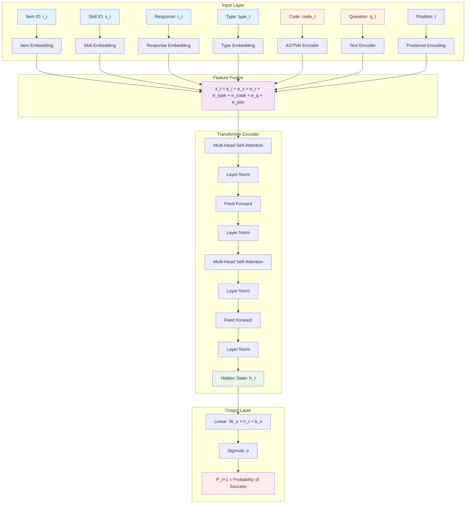
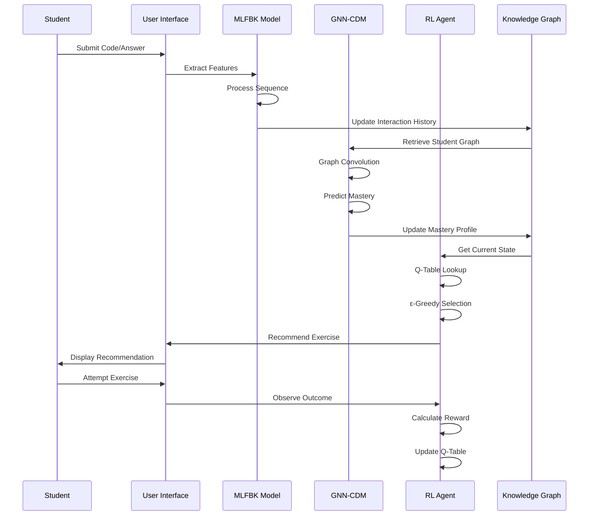
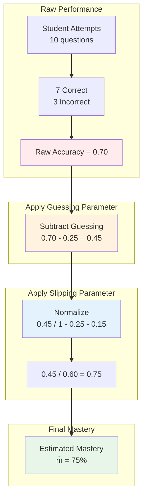
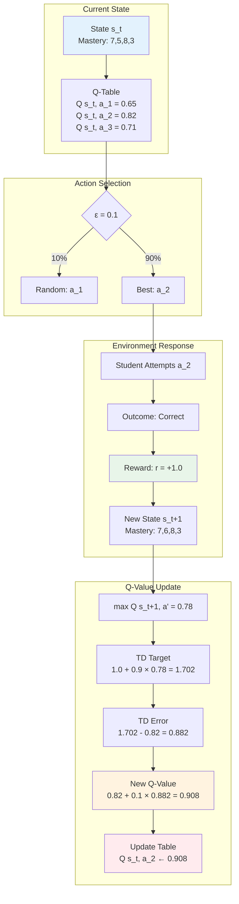

# AI Models: Mathematical Formulations & Diagrams

This document provides detailed mathematical formulations and architectural diagrams for the three core AI models in the KTCD platform.

---

## 1. MLFBK (Multi-Layer Feature-Based Knowledge Tracing)

### Architecture Diagram



### Mathematical Formulation

#### 1. Input Embeddings
```
e_i = Embedding_item(i_t)           ∈ ℝ^d
e_s = Embedding_skill(s_t)          ∈ ℝ^d
e_r = Embedding_response(r_t)       ∈ ℝ^d
e_type = Embedding_type(type_t)     ∈ ℝ^d
e_code = ASTNN(code_t)              ∈ ℝ^d
e_q = TextEncoder(q_t)              ∈ ℝ^d
e_pos = PositionalEncoding(t)       ∈ ℝ^d
```

#### 2. Feature Fusion
```
x_t = e_i + e_s + e_r + e_type + e_code + e_q + e_pos
```

#### 3. Multi-Head Self-Attention
```
Attention(Q, K, V) = softmax(QK^T / √d_k) V

where:
Q = x_t W_Q    (Query)
K = x_t W_K    (Key)
V = x_t W_V    (Value)

MultiHead(x_t) = Concat(head_1, ..., head_h) W_O

where head_i = Attention(x_t W_Q^i, x_t W_K^i, x_t W_V^i)
```

#### 4. Feed-Forward Network
```
FFN(x) = max(0, xW_1 + b_1)W_2 + b_2
```

#### 5. Transformer Layer
```
h'_t = LayerNorm(x_t + MultiHead(x_t))
h_t = LayerNorm(h'_t + FFN(h'_t))
```

#### 6. Output Prediction
```
P(correct_{t+1} | h_t) = σ(W_o h_t + b_o)

where σ(z) = 1 / (1 + e^(-z))
```

### Key Equations

**Loss Function (Binary Cross-Entropy):**
```
L = -1/N ∑_{t=1}^N [y_t log(P_t) + (1 - y_t)log(1 - P_t)]

where:
y_t = actual response (0 or 1)
P_t = predicted probability
N = sequence length
```

**Knowledge State Evolution:**
```
h_t = Transformer(x_1, x_2, ..., x_t)

The hidden state h_t represents the student's knowledge state at time t
```

---

## 2. GNN-CDM (Graph Neural Network - Cognitive Diagnosis Model)

### Architecture Diagram

```mermaid
graph TB
    subgraph "Knowledge Graph"
        S[Student Node<br/>Features: [1,0,0,0]]
        KC1[KC Node 1<br/>Features: [0,1,0,0]]
        KC2[KC Node 2<br/>Features: [0,1,0,0]]
        KC3[KC Node 3<br/>Features: [0,1,0,0]]
        I1[Interaction 1<br/>Features: [0,0,1,0]]
        I2[Interaction 2<br/>Features: [0,0,1,0]]
        Q1[Question 1<br/>Features: [0,0,0,1]]
        
        S -->|mastery: m_1| KC1
        S -->|mastery: m_2| KC2
        S -->|mastery: m_3| KC3
        S -->|performed| I1
        S -->|performed| I2
        S -->|asked| Q1
        I1 -->|involves| KC1
        I2 -->|involves| KC2
        Q1 -->|tests| KC2
    end
    
    subgraph "GCN Layer 1"
        G1[Graph Convolution]
        G1 --> R1[ReLU Activation]
        R1 --> H1[Hidden Representations h^1]
    end
    
    subgraph "GCN Layer 2"
        H1 --> G2[Graph Convolution]
        G2 --> H2[Final Embeddings h^2]
    end
    
    subgraph "Mastery Prediction"
        H2 --> SE[Student Embedding: h_s]
        H2 --> KE[KC Embeddings: h_k1, h_k2, h_k3]
        SE --> C1[Concat: h_s || h_k1]
        KE --> C1
        C1 --> MLP[MLP Layer]
        MLP --> SIG[Sigmoid]
        SIG --> M[Mastery: m̂_k]
    end
    
    style S fill:#4a90e2,color:#fff
    style KC1 fill:#e74c3c,color:#fff
    style KC2 fill:#e74c3c,color:#fff
    style KC3 fill:#e74c3c,color:#fff
    style I1 fill:#f39c12,color:#fff
    style I2 fill:#f39c12,color:#fff
    style Q1 fill:#2ecc71,color:#fff
    style M fill:#9b59b6,color:#fff
```

### Mathematical Formulation

#### 1. Graph Convolutional Layer
```
H^(l+1) = σ(D̃^(-1/2) Ã D̃^(-1/2) H^(l) W^(l))

where:
à = A + I_N                    (adjacency matrix with self-loops)
D̃_ii = ∑_j Ã_ij               (degree matrix)
H^(l) = node features at layer l
W^(l) = learnable weight matrix
σ = activation function (ReLU)
```

#### 2. Message Passing (Simplified)
```
h_i^(l+1) = σ(W^(l) · (h_i^(l) + ∑_{j∈N(i)} h_j^(l) / |N(i)|))

where:
h_i^(l) = embedding of node i at layer l
N(i) = neighbors of node i
|N(i)| = number of neighbors
```

#### 3. Mastery Prediction
```
m̂_k = σ(MLP([h_s || h_k]))

where:
h_s = student embedding from GNN
h_k = knowledge component embedding from GNN
|| = concatenation operator
MLP = Multi-Layer Perceptron
σ = sigmoid activation

Expanded:
m̂_k = σ(W_2 · ReLU(W_1 · [h_s || h_k] + b_1) + b_2)
```

#### 4. Loss Function
```
L = ∑_{k∈KC} (m_k - m̂_k)^2 + λ||W||^2

where:
m_k = true mastery level
m̂_k = predicted mastery level
λ = regularization parameter
||W||^2 = L2 regularization term
```

### Guessing and Slipping Parameters

#### Guessing Parameter (g)
**Definition:** Probability that a student answers correctly despite not having mastered the skill.

```
g = P(correct | not mastered)

Typical value: g = 0.25 (for 4-option multiple choice)
```

#### Slipping Parameter (s)
**Definition:** Probability that a student answers incorrectly despite having mastered the skill.

```
s = P(incorrect | mastered)

Typical value: s = 0.15 (careless errors)
```

#### Item Response Function (IRT with Guessing & Slipping)
```
P(correct | mastery = m) = g + (1 - g - s) · m

where:
m ∈ [0, 1] = mastery level
g = guessing parameter
s = slipping parameter

Special cases:
- If m = 0 (no mastery): P(correct) = g
- If m = 1 (full mastery): P(correct) = 1 - s
```

#### Inverse: Estimating Mastery from Accuracy
```
m̂ = (accuracy - g) / (1 - g - s)

where:
accuracy = observed proportion correct
m̂ = estimated mastery level

Example:
If accuracy = 0.70, g = 0.25, s = 0.15:
m̂ = (0.70 - 0.25) / (1 - 0.25 - 0.15)
m̂ = 0.45 / 0.60 = 0.75 (75% mastery)
```

#### Bayesian Knowledge Tracing (BKT) with Guessing & Slipping
```
P(L_t | correct) = [P(L_{t-1})(1-s)] / [P(L_{t-1})(1-s) + (1-P(L_{t-1}))g]

P(L_t | incorrect) = [P(L_{t-1})s] / [P(L_{t-1})s + (1-P(L_{t-1}))(1-g)]

where:
L_t = latent knowledge state at time t
P(L_t) = probability of mastery at time t
```

---

## 3. RL Recommender Agent (Q-Learning)

### Architecture Diagram

```mermaid
graph TB
    subgraph "State Space"
        M[Mastery Profile<br/>m = [m_1, m_2, ..., m_K]]
        M --> D[Discretize]
        D --> S[State: s = d_1, d_2, ..., d_K<br/>where d_i ∈ {0,1,...,10}]
    end
    
    subgraph "Q-Table"
        S --> Q[Q-Table Lookup<br/>Q: S × A → ℝ]
        Q --> QV[Q-values: Q s, a_1, Q s, a_2, ..., Q s, a_n]
    end
    
    subgraph "Action Selection"
        QV --> E{ε-greedy}
        E -->|ε probability| R[Explore<br/>a ~ Uniform A]
        E -->|1-ε probability| G[Exploit<br/>a = argmax_a' Q s,a']
        R --> A[Action: a<br/>Recommend Exercise]
        G --> A
    end
    
    subgraph "Environment"
        A --> EX[Student Attempts<br/>Exercise a]
        EX --> O[Observe Outcome<br/>correct/incorrect]
        O --> RW[Calculate Reward r]
        RW --> NS[New State s']
    end
    
    subgraph "Q-Update"
        NS --> QN[Q s', a']
        QN --> TD[TD Target<br/>r + γ max_a' Q s',a']
        TD --> U[Update<br/>Q s,a ← Q s,a + α TD - Q s,a]
        U --> Q
    end
    
    style S fill:#e3f2fd
    style A fill:#fff3e0
    style RW fill:#e8f5e9
    style U fill:#ffebee
```

### Mathematical Formulation

#### 1. State Representation
```
s_t = discretize(m_1, m_2, ..., m_K)

where:
m_k ∈ [0, 1] = continuous mastery for KC k
discretize(m_k) = ⌊10 × m_k⌋ ∈ {0, 1, ..., 10}

Example:
m = [0.73, 0.45, 0.89] → s = (7, 4, 9)
```

#### 2. Action Space
```
A = {a_1, a_2, ..., a_N}

where each a_i represents recommending exercise i
```

#### 3. ε-Greedy Policy
```
π(a|s) = {
    1 - ε + ε/|A|,  if a = argmax_a' Q(s, a')
    ε/|A|,          otherwise
}

Simplified:
a_t = {
    random action from A,           with probability ε
    argmax_a Q(s_t, a),            with probability 1-ε
}
```

#### 4. Exploration Rate Decay
```
ε_t = ε_min + (ε_max - ε_min) × e^(-λ × t)

where:
ε_max = 1.0 (initial exploration)
ε_min = 0.01 (minimum exploration)
λ = 0.01 (decay rate)
t = episode number
```

#### 5. Reward Function
```
r_t = {
    +1.0,                           if correct and m_k < 0.8
    +0.5,                           if correct and m_k ≥ 0.8
    -0.5,                           if incorrect and m_k < 0.5
    -1.0,                           if incorrect and m_k ≥ 0.5
}

Bonus rewards:
r_t += 0.5 × (m_k^new - m_k^old)    (improvement bonus)
r_t += 1.0                           if m_k^new ≥ 0.8 and m_k^old < 0.8 (mastery bonus)
```

#### 6. Q-Learning Update (Bellman Equation)
```
Q(s_t, a_t) ← Q(s_t, a_t) + α[r_t + γ max_a' Q(s_{t+1}, a') - Q(s_t, a_t)]

where:
α = 0.1 (learning rate)
γ = 0.9 (discount factor)
r_t = immediate reward
max_a' Q(s_{t+1}, a') = maximum future value
```

#### 7. Temporal Difference (TD) Error
```
δ_t = r_t + γ max_a' Q(s_{t+1}, a') - Q(s_t, a_t)

The TD error represents the difference between:
- Expected return: r_t + γ max_a' Q(s_{t+1}, a')
- Current estimate: Q(s_t, a_t)
```

#### 8. Value Function
```
V(s) = max_a Q(s, a)

The value of a state is the maximum Q-value over all actions
```

#### 9. Optimal Policy
```
π*(s) = argmax_a Q*(s, a)

After convergence, the optimal policy selects the action with highest Q-value
```

---

## Summary of Key Equations

### MLFBK
| Component | Equation |
|-----------|----------|
| Feature Fusion | `x_t = ∑ embeddings` |
| Attention | `Attention(Q,K,V) = softmax(QK^T/√d_k)V` |
| Prediction | `P_t = σ(W_o h_t + b_o)` |
| Loss | `L = -∑[y log(P) + (1-y)log(1-P)]` |

### GNN-CDM
| Component | Equation |
|-----------|----------|
| Graph Conv | `H^(l+1) = σ(D̃^(-1/2)ÃD̃^(-1/2)H^(l)W^(l))` |
| Mastery | `m̂_k = σ(MLP([h_s ‖ h_k]))` |
| Guessing | `g = P(correct \| not mastered) = 0.25` |
| Slipping | `s = P(incorrect \| mastered) = 0.15` |
| IRT | `P(correct) = g + (1-g-s)m` |
| Inverse | `m̂ = (acc - g)/(1 - g - s)` |

### RL Agent
| Component | Equation |
|-----------|----------|
| Q-Update | `Q(s,a) ← Q(s,a) + α[r + γ max Q(s',a') - Q(s,a)]` |
| ε-Greedy | `a = argmax Q(s,a)` with prob `1-ε`, else random |
| ε-Decay | `ε_t = ε_min + (ε_max - ε_min)e^(-λt)` |
| TD Error | `δ = r + γ max Q(s',a') - Q(s,a)` |

---

## Complete System Integration

### End-to-End Workflow



### Data Flow Diagram

```mermaid
graph LR
    subgraph "Input Data"
        A[Student Interaction<br/>code, question, response]
    end

    subgraph "MLFBK Processing"
        A --> B[Feature Extraction]
        B --> C[Transformer Encoding]
        C --> D[Knowledge State h_t]
    end

    subgraph "Knowledge Graph Update"
        D --> E[Add Interaction Node]
        E --> F[Update Edge Weights]
        F --> G[Student Graph G_s]
    end

    subgraph "GNN-CDM Processing"
        G --> H[Graph Convolution]
        H --> I[Node Embeddings]
        I --> J[Mastery Prediction]
        J --> K[Apply Guessing/Slipping]
        K --> L[Refined Mastery m̂]
    end

    subgraph "RL Recommendation"
        L --> M[Discretize State s]
        M --> N[Q-Table Lookup]
        N --> O[ε-Greedy Policy]
        O --> P[Action Selection a]
    end

    subgraph "Feedback Loop"
        P --> Q[Student Attempts]
        Q --> R[Calculate Reward r]
        R --> S[Update Q s,a]
        S --> N
        Q --> A
    end

    style D fill:#e3f2fd
    style L fill:#fff3e0
    style P fill:#e8f5e9
    style R fill:#ffebee
```



### Mastery Calculation with Guessing & Slipping



### Q-Learning Update Process



---

## Hyperparameters Summary

### MLFBK Hyperparameters
```python
embedding_dim = 64          # Dimension of all embeddings
num_heads = 8               # Number of attention heads
num_layers = 4              # Number of transformer layers
max_seq_len = 100          # Maximum sequence length
dropout = 0.1              # Dropout rate
learning_rate = 0.001      # Adam optimizer learning rate
batch_size = 32            # Training batch size
```

### GNN-CDM Hyperparameters
```python
num_node_features = 4      # [student, kc, interaction, question]
embedding_dim = 64         # GNN embedding dimension
num_gcn_layers = 2         # Number of graph conv layers
guessing_param = 0.25      # g = P(correct | not mastered)
slipping_param = 0.15      # s = P(incorrect | mastered)
learning_rate = 0.01       # Optimizer learning rate
l2_regularization = 0.001  # Weight decay
```

### RL Agent Hyperparameters
```python
learning_rate = 0.1        # α (alpha) - Q-learning rate
discount_factor = 0.9      # γ (gamma) - future reward discount
epsilon_max = 1.0          # Maximum exploration rate
epsilon_min = 0.01         # Minimum exploration rate
epsilon_decay = 0.01       # Exploration decay rate
state_discretization = 10  # Number of discrete mastery levels
```

---

## Performance Metrics

### MLFBK Evaluation
```
Accuracy = (TP + TN) / (TP + TN + FP + FN)
Precision = TP / (TP + FP)
Recall = TP / (TP + FN)
F1-Score = 2 × (Precision × Recall) / (Precision + Recall)
AUC-ROC = Area Under ROC Curve
```

### GNN-CDM Evaluation
```
RMSE = √(1/N ∑(m_k - m̂_k)²)
MAE = 1/N ∑|m_k - m̂_k|
Correlation = corr(m, m̂)
```

### RL Agent Evaluation
```
Cumulative Reward = ∑_{t=1}^T r_t
Average Mastery Gain = 1/K ∑_{k=1}^K (m_k^final - m_k^initial)
Learning Efficiency = Mastery Gain / Number of Exercises
```

---

**Document Version:** 1.0
**Last Updated:** October 22, 2025
**Author:** KTCD Development Team

